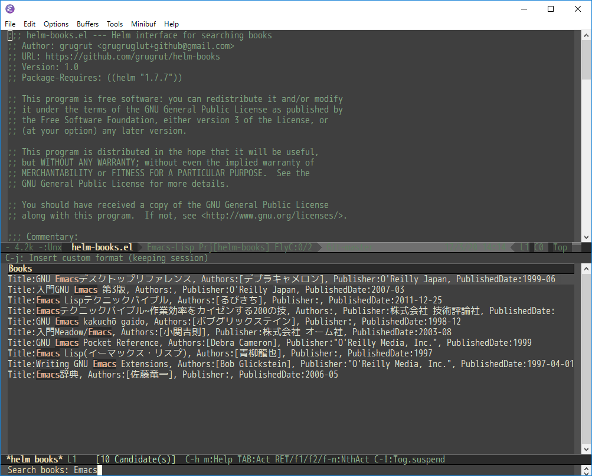

# helm-books

`helm-books.el` is a helm interface for searching books.

You can search books using google books api, and insert with custom format.

## Image



### Requirements

- helm 1.7.7 or higher

## Installation

Copy helm-books.el to a directory in your `load-path`.

## Setup

``` emacs-lisp
(require 'helm-books)
(setq helm-books-custom-format "Your preferred format.") ; Default is "#title#\n:PROPERTIES:\n:AUTHORS:#author#:END:"
```

## Command

### `M-x helm-books`

Search books.

Actions are
- Insert with custom format
- Insert

## Integration of org-capture

Write following setting in your init.el, you can org-capture.

``` emacs-lisp
(setq org-capture-templates
        '(("b" "book memo" entry
           (file (concat org-directory "book.org"))
           "* %(helm-books)"
          ))))
```

Using this template, helm interface is displayed.
Then easy to capture including book information.

```
* Writing GNU Emacs Extensions
:AUTHORS:[Bob Glickstein]
```
